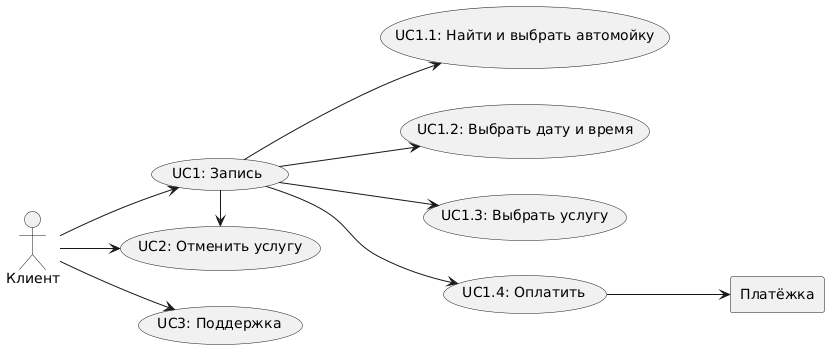

# IIS

### Примерные показатели:

| Показатель | Значение |
|---|---|
| Region | Сахалинская область |
| Population | 500,000 |
| DAU  | 75,000 |
| RPS  | ~1 |

### User Story

1.Как клиент, я хочу иметь возможность записаться на мойку через мобильное приложение, чтобы не заходить на сайт и быстро завершить процесс.

2.Как клиент, я хочу получать уведомления о специальных акциях и скидках на услуги автомойки, чтобы сэкономить деньги на мойке моего автомобиля.

3.Как клиент, я хочу видеть отзывы других клиентов о различных пакетах услуг, чтобы лучше понимать, что стоит выбрать.

4.Как клиент, я хочу иметь возможность выбрать тип мойки (ручная, автоматическая) при записи, чтобы получить именно тот сервис, который мне нужен.

5.Как клиент, я хочу получать напоминания о необходимости мойки автомобиля на основе пробега, чтобы поддерживать его в чистоте и хорошем состоянии.

6.Как клиент, я хочу иметь возможность задать вопросы о процессе мойки или доступных услугах через чат на сайте, чтобы получить необходимую информацию перед записью.

7.Как клиент, я хочу видеть информацию о времени, необходимом для выполнения различных услуг, чтобы правильно планировать свой день.

8.Как клиент, я хочу иметь возможность выбрать дополнительные услуги, такие как защита кузова или обработка салона, при записи на мойку, чтобы получить полный уход за автомобилем.

9.Как клиент, я хочу иметь возможность отменить или перенести запись на мойку через мобильное приложение, чтобы не терять время, если мои планы изменилис

10.Как клиент, я хочу видеть фотографии предыдущих работ автомойки в галерее на сайте, чтобы оценить качество услуг и принять решение о записи.

### Функциональные требования:
### Use Case 

### Сценарии использования:  

### UC1: Запись на мойку
- **Участники**: пользователь приложения
- **Предусловия**: пользователь выбрал автомойку из списка, определил дату и время, выбрал услугу, ввел необходимые данные и подтвердил свою личную информацию.
- **Условия для начала сценария**: пользователь нажимает кнопку "Записаться", вводит данные и подтверждает номер телефона.
- **Признак успешности**: пользователь успешно записан на мойку, появляется уведомление: "Вы успешно записаны на автомойку!"

### Базовый сценарий:
<ol>
<li>Появляется окно с сообщением о том, что запись на автомойку прошла успешно.</li>

 1.1. Альтернативный сценарий: 

		
Проблемы с интернет-соединением: Выдать пользователю сообщение об ошибке соединения. Рекомендовать позвонить администратору автомойки для записи.

 1.2. Альтернативный сценарий: 

		
Ошибка сервера: Уведомить пользователя о технических работах в системе и попросить его зайти позже или обратиться к администратору автомойки по телефону.

</ol>

### UC1_1: Поиск и выбор автомойки
- **Участники**: пользователь приложения
- **Предусловия**: пользователь открыл приложение.
- **Условия для начала сценария**: пользователь нажимает кнопку "Найти мойку".
- **Признак успешности**: пользователь видит список доступных моек и выбирает одну из них.

### Базовый сценарий:
<ol>
<li>Система предлагает пользователю использовать геолокацию.</li>
<li>Если пользователь согласен предоставить геолокацию, то:
	<ul>
		<li>Система ищет ближайшие автомойки и отображает их на карте.</li>
		<li>Система предоставляет пользователю карту или список ближайших автомоек.</li>
	</ul>
</li>
<li>Если пользователь отказывается:
	<ul>
		<li>Система показывает список всех автомоек в его городе.</li>
	</ul>
</li>
<li>Пользователь выбирает автомойку из предложенного списка или указывает ее на карте.</li>
</ol>

 1_1.1. Альтернативный сценарий: 

		
 Проблемы с интернет-соединением: Выдать пользователю сообщение об ошибке соединения. Рекомендовать позвонить администратору автомойки для записи.

 1_1.2. Альтернативный сценарий: 
		
 Ошибка сервера: Уведомить пользователя о технических работах в системе и попросить его зайти позже или обратиться к администратору автомойки по телефону.

 1_1.3. Альтернативный сценарий: 

		
 Выбранная мойка закрыта: Сообщить пользователю, что выбранная мойка закрыта, и предложить выбрать другую.

### UC1_2: Установка даты и времени
- **Участники**: пользователь приложения
- **Предусловия**: пользователь выбрал автомойку из списка.
- **Условия для начала сценария**: пользователь нажимает кнопку "Выбрать дату и время".
- **Признак успешности**: пользователь видит список доступных временных слотов для записи.

### Базовый сценарий:
<ol>
<li>Система находит выбранную мойку в базе данных и отображает доступные даты для записи.</li>
<li>Пользователь выбирает нужную дату и время из списка свободных вариантов.</li>
</ol>

 1_2.1. Альтернативный сценарий: 

		
 Проблемы с интернет-соединением: Выдать пользователю сообщение об ошибке соединения. Рекомендовать позвонить администратору автомойки для записи.

 1_2.2. Альтернативный сценарий: 

		
 Ошибка сервера: Уведомить пользователя о технических работах в системе и попросить его зайти позже или обратиться к администратору автомойки по телефону.

 1_2.3. Альтернативный сценарий: 

		
 Выбранная мойка закрыта: Сообщить пользователю, что выбранная мойка закрыта, и предложить выбрать другую.

### UC1_3: Выбор услуги
- **Участники**: пользователь приложения
- **Предусловия**: пользователь выбрал автомойку и определил дату и время записи, подтвердил свои данные.
- **Условия для начала сценария**: пользователь нажимает кнопку "Выбрать услугу".
- **Признак успешности**: пользователь видит список услуг, предлагаемых данной мойкой, и выбирает подходящую.

### Базовый сценарий:
<ol>
<li>Система находит выбранную мойку в базе данных и отображает доступные услуги.</li>
<li>Пользователь выбирает услугу из списка и нажимает кнопку "Записаться".</li>
</ol>

 1_3.1. Альтернативный сценарий: 

		
 Проблемы с интернет-соединением: Выдать пользователю сообщение об ошибке соединения. Рекомендовать позвонить администратору автомойки для записи.

 1_3.2. Альтернативный сценарий: 

		
 Ошибка сервера: Уведомить пользователя о технических работах в системе и попросить его зайти позже или обратиться к администратору автомойки по телефону.

 1_3.3. Альтернативный сценарий: 

		
 Выбранная услуга недоступна: Сообщить пользователю, что выбранная услуга недоступна, и предложить выбрать другую.

### UC1_4: Оплата
- **Участники**: пользователь приложения
- **Предусловия**: пользователь выбрал автомойку, дату, время, услугу и подтвердил свои данные.
- **Условия для начала сценария**: пользователь нажимает кнопку "Записаться", вводит данные и подтверждает запись.
- **Признак успешности**: оплата прошла успешно, или пользователь выбрал другой способ оплаты (наличными).

### Базовый сценарий:
<ol>

Если пользователь выбрал онлайн-оплату, то:

<li>Пользователь видит стоимость всех услуг.</li>
<li>Пользователь выбирает способ оплаты и завершает транзакцию.</li>
<li>Появляется уведомление об успешной операции.</li>
</ol>
<ol>

Если пользователь выбрал офлайн-оплату:

<li>Пользователь видит стоимость всех услуг.</li>
<li>Пользователь нажимает кнопку "Оплатить на мойке".</li>
<li>Появляется уведомление об успешном выборе.</li>
</ol>

 1_4.1. Альтернативный сценарий: 

		
 Проблемы с интернет-соединением: Выдать пользователю сообщение об ошибке соединения. Рекомендовать позвонить администратору автомойки для записи.

 1_4.2. Альтернативный сценарий: 

		
 Ошибка сервера: Уведомить пользователя о технических работах в системе и попросить его зайти позже или обратиться к администратору автомойки по телефону.

 1_4.3. Альтернативный сценарий: 

		
 Ошибка при оплате: Сообщить пользователю, что оплата не прошла, и предложить оплатить наличными на мойке или попробовать снова.

### UC2: Отмена услуги
- **Участники**: пользователь приложения
- **Предусловия**: пользователь записался на мойку.
- **Условия для начала сценария**: пользователь нажимает кнопку "Отменить запись".
- **Признак успешности**: запись пользователя отменена.

### Базовый сценарий:
<ol>
<li>Пользователь вводит свой номер телефона и подтверждает его.</li>
<li>Пользователь нажимает кнопку "Мои услуги".</li>
<li>Система обращается к базе данных и отображает список услуг, связанных с данным номером, на текущую дату.</li>
<li>Пользователь выбирает запись и нажимает кнопку "Отменить".</li>
<li>Появляется уведомление об успешной отмене записи.</li>
</ol>

 2_1. Альтернативный сценарий: 

		
 Проблемы с интернет-соединением: Выдать пользователю сообщение об ошибке соединения. Рекомендовать позвонить администратору автомойки для записи.

 2_2. Альтернативный сценарий: 

		
 Ошибка сервера: Уведомить пользователя о технических работах в системе и попросить его зайти позже или обратиться к администратору автомойки по телефону.

### UC3: Техническая поддержка
- **Участники**: пользователь приложения
- **Предусловия**: пользователь ввел номер телефона и подтвердил его.
- **Условия для начала сценария**: пользователь нажимает кнопку "Техническая поддержка".
- **Признак успешности**: пользователь связывается с технической поддержкой.

### Базовый сценарий:
<ol>
<li>Пользователь вводит свой номер телефона и подтверждает его.</li>
<li>Пользователь нажимает кнопку "Техническая поддержка".</li>
<li>Система проверяет наличие свободных сотрудников.</li>
<li>Система создает чат между пользователем и доступным сотрудником технической поддержки.</li>
<li>Система организует обмен сообщениями между пользователем и технической поддержкой.</li>
</ol>

 3_1. Альтернативный сценарий: 

		
 Проблемы с интернет-соединением: Выдать пользователю сообщение об ошибке соединения. Рекомендовать позвонить администратору автомойки для записи.

 3_2. Альтернативный сценарий: 

		
 Ошибка сервера: Уведомить пользователя о технических работах в системе и попросить его зайти позже или обратиться к администратору автомойки по телефону.

